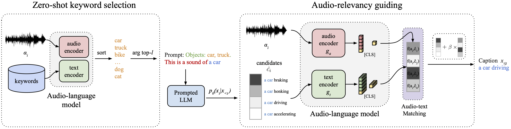

<div align="center">

# Zero-shot audio captioning with audio-language model guidance and audio context keywords

[](arxiv.org/abs/2311.08396)
[-2023-4b44ce.svg)](https://neurips.cc/virtual/2023/workshop/66516)
<br>
[](https://www.python.org/)
[](https://pytorch.org/get-started/locally/)
[](https://docs.astral.sh/ruff/)
[](https://opensource.org/license/mit)
</div>

## Description

This repository is the official implementation of the **NeurIPS 2023 - Machine Learning for Audio Workshop (Oral)** _Zero-shot audio captioning with audio-language model guidance and audio context keywords_ by [Leonard Salewski](https://www.eml-unitue.de/people/leonard-salewski), Stefan Fauth, [A. Sophia Koepke](https://akoepke.github.io/), and [Zeynep Akata](https://www.eml-munich.de/people/zeynep-akata) from the [University of Tübingen](https://uni-tuebingen.de/en/) and the [Tübingen AI Center](https://tuebingen.ai/).

## Abstract



<p align="justify">
Zero-shot audio captioning aims at automatically generating descriptive textual captions for audio content without prior training for this task. Different from speech recognition which translates audio content that contains spoken language into text, audio captioning is commonly concerned with ambient sounds, or sounds produced by a human performing an action. Inspired by zero-shot image captioning methods, we propose ZerAuCap, a novel framework for summarising such general audio signals in a text caption without requiring task-specific training. In particular, our framework exploits a pre-trained large language model (LLM) for generating the text which is guided by a pre-trained audio-language model to produce captions that describe the audio content. Additionally, we use audio context keywords that prompt the language model to generate text that is broadly relevant to sounds.
Our proposed framework achieves state-of-the-art results in zero-shot audio captioning on the AudioCaps and Clotho datasets.
</p>

## Code

The following Readme explains how to setup the environment, download the data, inference our ZerAuCap model and how to evaluate its predictions. In addition, there are further folder-specific Readme files that explain the purpose of the subfolders content.

### 1. Environment setup

We use [conda](https://docs.conda.io/projects/miniconda/en/latest/) to set up our environment. Run the following steps after cloning the environment:

1. Create a new conda environment

```bash
conda env create -f environment.yaml
```

2. Activate the environment

```bash
conda activate ZerAuCap
```

### 2. Data setup

The shell scripts are written in a way that requires the data to be in ``audio_captioning/softlinks``.

The structure should look like:

```bash
.
├── ./softlinks/  
    ├── AudioCaps_data  # stores AudioCaps .wav files
        ├── audiocaps_audio_clip_1.wav
        ├── ...
        └── ...
    ├── evaluation_data_files # stores Clotho .wav files
        ├── clotho_audio_clip_1.wav
        ├── ...
        └── ...
```

In case, you already have AudioCaps and Clotho's evaluation dataset loaded, it is enough to **specify the softlinks** in the directory and you can skip the following steps.

Alternatively, if you do not have the data yet, please follow the following steps.

#### AudioCaps (Download of validation and test data)

```bash
cd audio_captioning/softlinks
mkdir AudioCaps_data
cd AudioCaps_data
apt install ffmpeg youtube-dl
aac-datasets-download --root "." audiocaps --subsets "val"
aac-datasets-download --root "." audiocaps --subsets "test"
```

Move all ``.wav`` files into ``AudioCaps_data`` by running ``mv AUDIOCAPS_32000Hz/audio/test/*.wav .`` and ``mv AUDIOCAPS_32000Hz/audio/val/*.wav .``.

Make sure that the file names match with the file names in ```audio_captioning/data/AudioCaps/AudioCaps_val.json```, resp. ```audio_captioning/data/AudioCaps/AudioCaps_test.json```. If this is not the case, you can either change all file names, such that they match. Alternatively, check out the script ```audio_captioning/data/process_AudioCaps.py``` and create new ``.json`` files that match them with their GT captions.

#### Clotho (Download of evaluation data)

Run the follwoing script to download the evaluation, i.e. test data, of Clotho Version 2.1:

```bash
# Download of the data
wget https://zenodo.org/record/4783391/files/clotho_audio_evaluation.7z
# rename the data
mv clotho_audio_evaluation.7z evaluation_data_files.7z
# extract the data with 7z
7z x evaluation_data_files.7z
```

****

### 3. Audio CLIP Model Setup

We use three different pre-trained audio CLIP models. The following instructions show how to obtain the pre-trained checkpoints and required files.

#### AudioCLIP

AudioCLIP also requires a vocabulary file for the tokenizer (2nd link).

```bash
cd audio_captioning/clip
mkdir -p AudioCLIP/assets
cd AudioCLIP/assets
wget https://github.com/AndreyGuzhov/AudioCLIP/releases/download/v0.1/AudioCLIP-Full-Training.pt
wget -P https://github.com/AndreyGuzhov/AudioCLIP/releases/download/v0.1/bpe_simple_vocab_16e6.txt.gz
```

#### LAION CLAP

```bash
cd audio_captioning/clip
mkdir -p CLAP/assets
cd CLAP/assets
wget https://huggingface.co/lukewys/laion_clap/resolve/main/630k-audioset-fusion-best.pt
```

#### WavCaps

Download the checkpoint using [gdown](https://github.com/wkentaro/gdown):

```bash
cd audio_captioning/clip
mkdir -p WavCaps/retrieval/assets
cd WavCaps/retrieval/assets
gdown 1il6X1EiUPlbyysM9hn2CYr-YRSCuSy2m
```

****

### 4. Natural Language Generation Evaluation Metrics Setup

To evaluate the quality of the predicted texts, run the following script to setup NLG evaluation.

```bash
bash audio_captioning/evaluation/get_stanford_models.sh
```

****

### 5. Running Inference

In the folder ``audio_captioning/sh_folder``, there are two types of shell scripts.

- Inference scripts: ``search_audioCLIPmodel_keywords.sh``
- Visualization and table creation scripts: ``create_X.sh``

For inference, we provide the pre-defined scripts in the following table. The columns have the following meaning:

- MAGIC: MAGIC search (on) OR greedy search with no guiding (off)
- Audio Model: Which audio CLIP model to use
- Keywords: Which keyword list to use for the Socratic prompt improvement
- Script: Name of the shell script that has to be run to use the row's main components

|MAGIC| Audio Model | Keywords | Script | Comment |
|----------|----------|---------|--------|---------|
|Off| - | - | [baseline.sh](audio_captioning/sh_folder/baseline.sh) | Baseline without audio guiding |
|Off| WavCaps | AudioSetKW | [WavCaps_AudioSet_KW.sh](audio_captioning/sh_folder/WavCaps_AudioSet_KW.sh) |  |
|Off| WavCaps | AudioSet+ChatGPT KW | [WavCaps_AudioSet+ChatGPT_KW.sh](audio_captioning/sh_folder/WavCaps_AudioSet+ChatGPT_KW.sh) |  |
|On | AudioCLIP | - | [MAGIC_AudioCLIP.sh](audio_captioning/sh_folder/MAGIC_AudioCLIP.sh) | |
|On | AudioCLIP | AudioSetKW | [MAGIC_AudioCLIP_AudioSet_KW.sh](audio_captioning/sh_folder/MAGIC_AudioCLIP_AudioSet_KW.sh) | |
|On | AudioCLIP | AudioSetKW+ChatGPT KW | [MAGIC_AudioCLIP_AudioSet+ChatGPT_KW.sh](audio_captioning/sh_folder/MAGIC_AudioCLIP_AudioSet+ChatGPT_KW.sh) | |
|On | LAION | - | [MAGIC_LAION.sh](audio_captioning/sh_folder/MAGIC_LAION.sh) | |
|On | LAION | AudioSetKW | [MAGIC_LAION_Audioset_KW.sh](audio_captioning/sh_folder/MAGIC_LAION_Audioset_KW.sh) | |
|On | LAION | AudioSetKW+ChatGPT KW | [MAGIC_LAION_AudioSet+ChatGPT_KW.sh](audio_captioning/sh_folder/MAGIC_LAION_AudioSet+ChatGPT_KW.sh) | |
|On | WavCaps | - | [MAGIC_WavCaps.sh](audio_captioning/sh_folder/MAGIC_WavCaps.sh) | |
|On | WavCaps | AudioSetKW | [MAGIC_WavCaps_AudioSet_KW.sh](audio_captioning/sh_folder/MAGIC_WavCaps_AudioSet_KW.sh) | Best Model|
|On | WavCaps | AudioSetKW+ChatGPT KW | [MAGIC_WavCaps_AudioSet+ChatGPT_KW.sh](audio_captioning/sh_folder/MAGIC_WavCaps_AudioSet+ChatGPT_KW.sh) | |

**TLDR**: Run the shell script [MAGIC_WavCaps_AudioSet_KW.sh](audio_captioning/sh_folder/MAGIC_WavCaps_AudioSet_KW.sh) to inference the best model.

****

### 6. Inspecting Results / Logs

The folder ```audio_captioning/inference_results/``` stores the result of all runs. If a new language model (LM) is selected, the program should automatically generate a new folder for the new model. Inside the LM's folder, there is one folder for each dataset:

1. ``AudioCaps/excludes_prompt_magic``
2. ``clotho_v2.1/excludes_prompt_magic``

Inside each folder, there are three subfolders analyzing the results.

1. ``evaluation``: Stores a ``.csv`` file containing the NLG metrics of every run:

|Dataset| Model | Mean NLG Score | ... | SPIDEr |
|----------|----------|---------|--------|---------|
|AudioSet| MAGIC_WavCaps_AudioSet_KW_l_test_ablation | 0.166 | ... | 0.138 |

2. ``output_tables``: Stores a HTML table containing the audio clip and sample-level results for qualitative analysis (NLG metrics, cosine similarities with the audio of the prediction, the prediction, etc).

3. ``output_jsons``: For every run a list of dictionaries containing the prediction for every sample and all hyperparameters:

```yaml
{
        "split": "test",
        "sound_name": "--0w1YA1Hm4_30000.wav",
        "captions": [
            "A vehicle driving as a man and woman are talking and laughing",
            "Men speak and laugh with humming of an engine",
            "High pitched speaking and laughing",
            "Humming of an engine with a woman and men speaking",
            "People talking with the dull roar of a vehicle on the road"
        ],
        "prediction": "laughter and joy.",
        "beta": 0.5,
        "prompt": "This is a sound of ",
        "k": 45,
        "alpha": 0,
        "decoding_len": 78,
        "clip_text_max_len": 77,
        "n_test_samples": 975,
        "included_prompt_in_magic": false,
        "dataset": "AudioCaps",
        "CLAP_type": "HTSAT-BERT-PT.pt",
        "temperature": 10,
        "l": 7,
        "keyword_prompt": "Objects: ",
        "end_penalty": 0.10000000149011612
    }
```

Each of the output folders (containing CSV, HTML or JSON files) has subfolders for the experiment type:

- ``validation``: Runs on the validation set to find the optimal hyperparameters (validation plot: Figure 2).
- ``test_performance``: Runs on the test set for model ablation (results in the state-of-the-art table (SOTA) and in the model ablation plot: Table 6, 7 and Figure 3).
- ``ablation``: Runs on the test set for hyperparamer ablation (values in the $\beta$ and $l$ ablation plots made with the best model found in validation: Figure 4, 5).

A run is uniquely identified by its time suffix, which allows all three output files to be matched for every run. The value in front of the timestamp is the average of all NLG metrics, indicating the quality of the run.

**TLDR**: There are **three output files** per run on a dataset. Click through all subfolders and pick the ones with the most recent timestamp to check on the results of the most recent run.

For further explanations, ``audio_captioning/README.md`` explains the output folder structure.

## Citation

Please cite our work with the following bibtex key.

```bib
@article{Salewski2023ZeroShotAudio,
  title   = {Zero-shot audio captioning with audio-language model guidance and audio context keywords},
  author  = {Leonard Salewski and Stefan Fauth and A. Sophia Koepke and Zeynep Akata},
  year    = {2023},
  journal = {arxiv:2311.08396},
}
```

You can also find our work on [Google Scholar](https://scholar.google.com/scholar_lookup?arxiv_id=2311.08396) and [Semantic Scholar](https://www.semanticscholar.org/paper/Zero-shot-audio-captioning-with-audio-language-and-Salewski-Fauth/87e80c9ff9a077e44e7b62a0cbad32dfadf4f1f4).

## Funding and Acknowledgments

The authors thank IMPRS-IS for supporting Leonard Salewski. This work was partially funded by the BMBF Tübingen AI Center (FKZ: 01IS18039A), DFG (EXC number 2064/1 – Project number 390727645), and ERC (853489-DEXIM).

Parts of this code base are taken from this [repository](https://github.com/yxuansu/MAGIC). We sincerely thank the authors for their valuable contribution.

## License

This repository is licensed under the MIT License.
